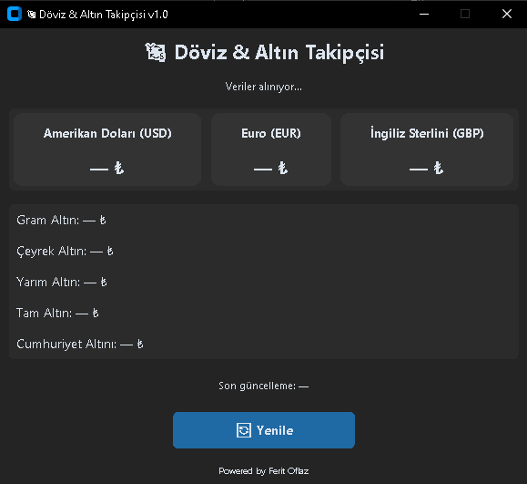

# 💱 Döviz & Altın Takipçisi v1.0

**Döviz & Altın Takipçisi**, anlık olarak döviz ve altın fiyatlarını takip etmenizi sağlayan modern bir masaüstü uygulamasıdır.  
Python ile geliştirilmiş olup, **CustomTkinter** kütüphanesiyle modern, sade ve karanlık temalı bir arayüze sahiptir.

---

## ⚙️ Özellikler
- ✅ Gerçek zamanlı **Dolar (USD)**, **Euro (EUR)**, **Sterlin (GBP)** fiyatları  
- ✅ Güncel **Gram**, **Çeyrek**, **Yarım**, **Tam**, **Cumhuriyet Altını** verileri  
- ✅ Otomatik veri yenileme ve manuel **Yenile** butonu  
- ✅ Modern ve minimalist arayüz tasarımı

---

## 💾 Windows Sürümü (.exe)

Hazır kurulumsuz çalıştırılabilir sürümü indirmek için aşağıdaki bağlantıya tıklayabilirsin 👇  

📦 [💾 **Döviz & Altın Takipçisi v1.0 indir**](https://github.com/FeritOflaz/Doviz-Altin-Takipcisi/raw/main/dist/DovizAltin_v1.0.exe)

> Bu sürüm herhangi bir Python kurulumu gerektirmez.  
> Sadece indirip **çalıştırman** yeterli ✅

---

## 📸 Uygulama Görseli

Uygulamanın arayüzü aşağıdaki gibidir 👇  

> Görsel: `preview.png` dosyası proje klasöründe bulunmalıdır.

---

## 👨‍💻 Geliştirici

**Powered by Ferit Oflaz**  
📅 Sürüm: `v1.0`  
🧠 Geliştirme Dili: Python  
🎨 Arayüz: CustomTkinter  
🌐 Veri Kaynağı: genelpara.com (API)

---

## 📜 Lisans

Bu proje [MIT Lisansı](https://opensource.org/licenses/MIT) altında lisanslanmıştır.  
Dilediğin şekilde **kullanabilir, geliştirebilir** veya **paylaşabilirsin**.  

---

 
**– Ferit Oflaz**
